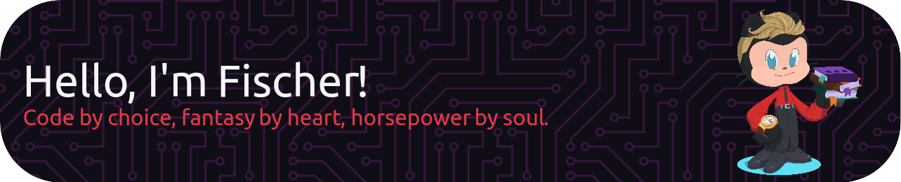

# 💫 About Me:
💼 I am currently working as a <b>Junior Frontend Developer</b>. 🛠️ In my free time, I build things like an <b>audiobook generator</b>, a <b>todo app</b>, and a <b>reading tracker</b>. 📚 I'm an avid <b>fantasy reader</b>. 🏍️ I have a soft spot for <b>motorcycles and cars</b>. 🐉 Also: <b>dragons. Always dragons.</b>

# 💻 Tech Stack:
              

# 📊 GitHub Stats:

<!-- Banner created with Profil Header Generator ( https://leviarista.github.io/github-profile-header-generator ) -->
<!-- Octocat created with myOctocat ( https://myoctocat.com ) -->
<!-- README created with GPRM ( https://gprm.itsvg.in ) -->
